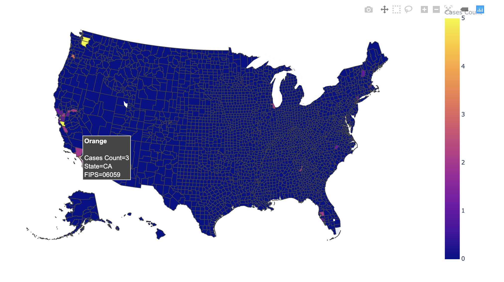
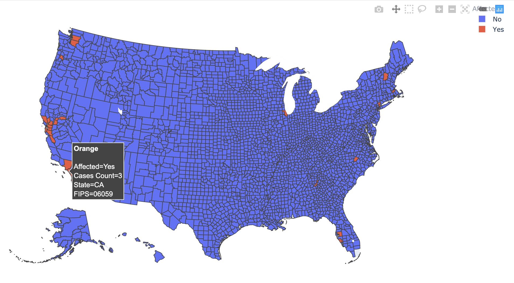

# US coronavirus cases map by county
As coronavirus spreads, I feel it's better to visualize the data in county unit for people to know about how is it going. That's why I did some little work to visualize it.

## Data 
Thanks to [一亩三分地](https://coronavirus.1point3acres.com/) for their great work collecting the data and sharing all those information. The plots would be real-time scrapped information.

## Visualization
I just realized that github is not that friendly to jupyter notebook plots. Please use the [nbviewer link](https://nbviewer.jupyter.org/github/suestring7/NCoronavirusMapbyCounty/blob/master/Coronavirus%20County%20Map%20for%20US.ipynb) to view the notebook.

### Sample plots:

